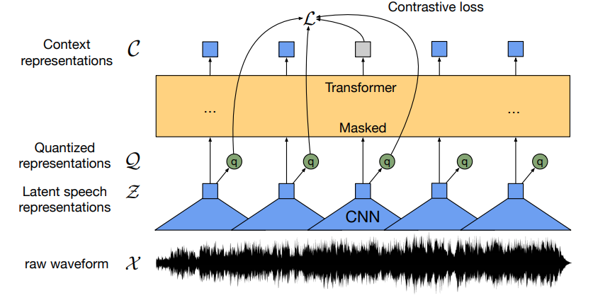

# Aphasia Classification Based on Patient Speech

## Repository Navigation

* models — Python files containing model classes  
* notebooks — Jupyter notebooks with experiments
* src — helper functions/classes and Streamlit web app  

## Problem Statement

Assistive systems are among the most demanded areas in machine learning.  
Even today, some doctors use artificial intelligence in their daily practice. It helps simplify diagnosis  
and enables personalized treatment for each patient.  
    
Our work focuses on building a model to predict the presence of aphasia in a patient. Aphasia is a speech disorder  
that affects speech comprehension. It often occurs after a stroke, traumatic brain injury, or diseases  
related to the central nervous system. This condition can severely impact a person’s ability to communicate,  
especially in elderly individuals. However, if therapy starts early enough, recovery is possible.  
Therefore, having a tool that can detect the first signs of aphasia is crucial.  

## Dataset

The dataset was provided by Center for Language and Brain, HSE University. It includes 353 participants with aphasia  
and 101 without. Each participant has approximately two audio recordings. The participants belong to different age groups.  
The average age of aphasic participants is 58, and the distribution is close to normal. The non-aphasic group’s age  
distribution is more uniform, containing both young and elderly subjects.  
   

## We have tested various methods

## Classical ML

As a baseline, classical machine learning was chosen, since in some cases it can be sufficient.  
FLAML was used because it automatically selects models and tunes their hyperparameters.  
Feature sets included MFCC+ZCR, Prosody Features+ZCR, and a combination of several types  
(MFCC, Chromagram, Spectral Features, Prosody Features, ZCR, Timestamps). Additionally we used optuna to tune catboost.                                                

## MFCC

MFCC represents audio using coefficients for time segments obtained by  
convolving the spectrogram with “special filters.” Physically,  
it simulates how human hearing processes speech (similar to Mel-spectrograms).  
Since our data consists of speech recordings, this representation captures relevant  
speech-related features.  

   
In the literature, both classical ML and 1D CNNs are commonly used with MFCCs.

## Waveform

One straightforward idea is to feed raw audio directly into a transformer. Below are the Wav2Vec model scheme:

Wav2Vec architecture

## Spectrograms

Spectrograms remain one of the most commonly used representations, so it was reasonable to test them as well

## Conclusion and Future Work

Various methods were tested, and for the final Streamlit application,  
Wav2Vec was chosen for its accuracy, and MobileNet on MFCC due to its speed and good performance.  
   
Although the classifier itself is complete, there is still room for exploration. For example,  
severity prediction remains an open goal.

## References

* [SwishNet: A Fast Convolutional Neural Network for Speech, Music and Noise Classification and Segmentation](https://arxiv.org/pdf/1812.00149). Md. Shamim Hussain, and Mohammad Ariful Haque. 2018  
* [Automatic Assessment of Aphasic Speech Sensed by Audio Sensors for Classification into Aphasia Severity Levels to Recommend Speech Therapies](https://www.semanticscholar.org/reader/62cde915437600a5ec56fca630dc970af732f1ed). Herath Mudiyanselage Dhammike Piyumal Madhurajith Herath,  
Weraniyagoda Arachchilage Sahanaka Anuththara Weraniyagoda,  
Rajapakshage Thilina Madhushan Rajapaksha, Patikiri Arachchige Don Shehan Nilmantha Wijesekara,  
Kalupahana Liyanage Kushan Sudheera, Peter Han Joo Chong. 2022  
* [A comparison of data augmentation methods in voice pathology detection](https://www.sciencedirect.com/science/article/pii/S0885230823000712). Farhad Javanmardi, Sudarsana Reddy Kadiri, Paavo Alku. 2022  
* [Predicting Severity in People with Aphasia: A Natural Language  
Processing and Machine Learning Approach](https://talkbank.org/aphasia/publications/2021/Day21.pdf). Marjory Day, Rupam Kumar Dey, Matthew Baucum, Eun Jin Paek, Hyejin Park, Anahita Khojandi. 2021  
* [An End-to-End Approach to Automatic Speech Assessment  
for Cantonese-speaking People with Aphasia](https://talkbank.org/aphasia/publications/2020/Qin20a.pdf). Ying Qin, Yuzhong Wu, Tan Lee, Anthony Pak Hin Kong. 2019  
